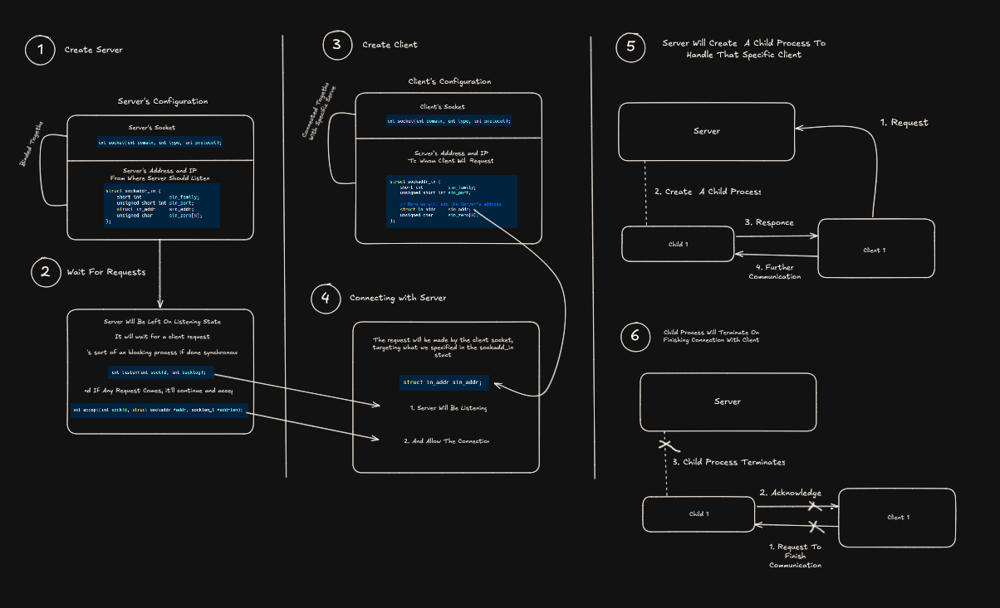
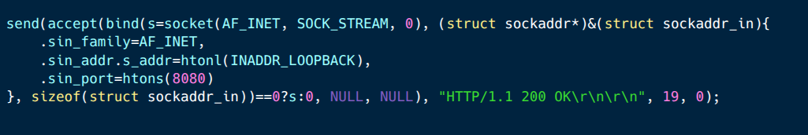

# C HTTP Server from Scratch

Back in 4th semester, we learned about **TCP** and **UDP** in our Computer Networks course.  
But one thing always bothered me — we never actually used those concepts to build anything real, like a server.

So, I decided to take a deep dive and build a basic **HTTP server using C** — just to understand how things really work under the hood.

As someone who's comfortable with JavaScript and TypeScript, **C felt brutal at first**.  
Seriously, what does this even mean?

Once I got the hang of `socket()`, `bind()`, `listen()`, and `accept()`, it wasn’t too bad.  
Understanding those core functions is key.

The second part — **serving actual files** — gets a little tricky, especially with C’s file handling,  
but it’s manageable with some patience.

---

> ⚡️ If you're someone who’s learned networking _theoretically_ and want to actually build something with it, I highly recommend trying this out.

📚 This guide helped me a ton:  
👉 [Beej's Guide to Network Programming](https://beej.us/guide/bgnet/html/)

📌 Visual Diagram:  
👉 [Excalidraw Link](https://excalidraw.com/#json=50_ODfE8o5WMIEJiDc85A,73FOjzUQnZNGUh2Liz3E6w)

---

💬 Would love to hear your thoughts or improvements!

